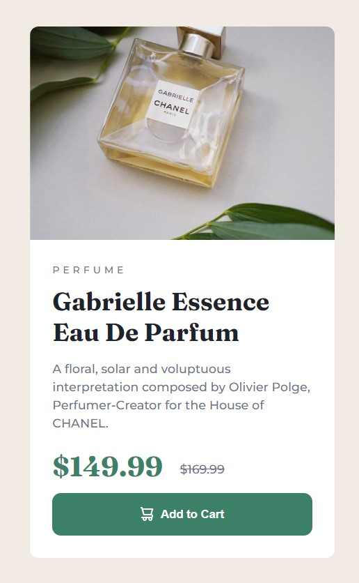

# Frontend Mentor - Product preview card component solution

This is a solution to the [Product preview card component challenge on Frontend Mentor](https://www.frontendmentor.io/challenges/product-preview-card-component-GO7UmttRfa). Frontend Mentor challenges help you improve your coding skills by building realistic projects.

## Table of contents

- [Overview](#overview)
  - [The challenge](#the-challenge)
  - [Screenshot](#screenshot)
  - [Links](#links)
- [My process](#my-process)
  - [Built with](#built-with)
  - [What I learned](#what-i-learned)
  - [Useful resources](#useful-resources)
- [Author](#author)

## Overview

### The challenge

Users should be able to:

- View the optimal layout depending on their device's screen size
- See hover and focus states for interactive elements

### Screenshot




### Links

- Solution URL: [https://danyczech.github.io/product-preview-card-component/](https://danyczech.github.io/product-preview-card-component/)

## My process

### Built with

- Semantic HTML5 markup
- Sass
- Flexbox
- Mobile-first workflow

### What I learned

```css
svg {
  margin-right: 0.3rem;
  vertical-align: sub;
}
```

I don't use vertical-align a lot, so it took me some time to find the proper solution for the svg inside the button.

```css
letter-spacing: 4px;
line-height: 1.4;
```

Just dropping there for the future some useful text properties.

### Useful resources

- [BEM - in Czech language](https://www.vzhurudolu.cz/prirucka/bem) - This helped me in naming the classes. Together with Sass it makes my code more readable.
- [How to avoid some problems when using CSS preprocessors - in Czech language](https://www.vzhurudolu.cz/blog/65-css-kod-problemy#1-zavorkove-peklo-a-monoliticnost) - This is an article which gaved me the example how to make notes to my code and how to avoid common mistakes when using Sass.

## Author

- Website - [On my github](https://danyczech.github.io/product-preview-card-component/)
- Frontend Mentor - [@danyczech](https://www.frontendmentor.io/profile/yourusername)
- Twitter - [@danyczech](https://www.twitter.com/yourusername)
